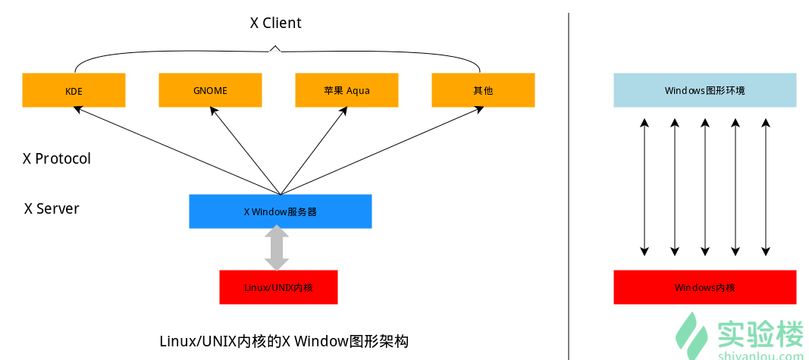

[实验楼](https://www.shiyanlou.com/courses/1/learning/?id=2)
## 1.入门
Linux操作系统内核基础
多任务和硬件管理
用户和系统管理员交互运行的程序
必须的程序:Shell,C编译器,GNU,TCP/IP网络,图形界面系统

Linux用途
- 搭建服务器
- 程序开发
- 日常办公
- 娱乐游戏

初级
- 系统安装
- 图形界面使用
- 常用命令

中级
- 用户和文件管理
- 软件安装配置
- 网络管理
- 系统维护
- shell 编程初步

高级
- 服务器领域
- 程序开发

## 2.基本概念与操作
桌面

终端(shell) 命令解释器 解释用户输入的命令 用户交互界面 空间系统的脚本语言
命令行体验: 输入 输出

### 重要快捷键
- Tab
- Ctrl + C
- Ctrl + d 结束终端
- Ctrl + s结束当前程序 恢复用fg
- ctrl + z将当前程序放到后台
- ctrl + a == home
- ctrl + e == end
- ctrl + k删除输入
- alt + backspace 删除前一个单词
- shift + pageup
- shift + pagedown
- 向上键 历史命令

通配符
- '*' 匹配0或者多个字符 eg: ls *.txt  ls q**y.txt
- ? 匹配任意字符,只匹配一个字符 eg: ls qi?.txt ls ???.txt
- [list] 匹配list中任意单一字符 只匹配一个字符和?一样, [0-9] [a-zA-Z][abcd][^abcd][!abcd]
- {c1c2} eg: touch love_{1..10}_you.txt将创建10个文件 生成序列文件
- {s,s,s} 备份: cp a{e,.bak} ae a.bak

