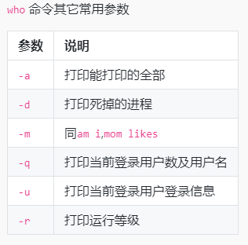
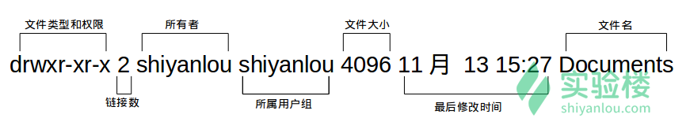

- linux 多用户登录：共享一些主机资源，但同时拥有自己的空间
- 用户管理
- 权限机制

who am i

root用户 终极大boss

普通用户使用root权限需要sudo，但有两个条件
- 直到当前用户密码
- 当前用户在root用户组

sudo adduser 添加用户
su user : 切换用户,但是要直到用户的密码
ls /home 查看用户
sudo passwd user 更改用户密码

用户组(共享一部分资源，但是又有自己私密空间)
groups user 查看user所属的用户组，显示格式 user:grouper
/etc/sudoers.d/user
group文件位于/etc/group（文件）
cat /etc/group | sort ,这里|sort对应着一个分类的处理
sudo usermod -G sudo lilei 将一个用户添加到sudo用户组中
sudo deluser username --remove-home

## 文件权限
文件的访问控制权限(那些用户以及那些用户群可以访问以及操作)
每个文件都包含了访问权限,这些访问权限决定了那些用户可以访问

### 查看文件权限

查看文件命令
ls -l 显示文件的具体信息
ls -A 显示全部文件

d:目录
-:普通文件

文件类型
/dev文件夹下有各种设备文件
socket
pipe
软连接文件

**文件权限**

### 变更文件所有者
sudo chown user file 更改用户

echo 'text' > file
chmod xxx file # 更改权限
chomd gou[+/-]rw # 更改权限

### 总结
sudo adduser 用户名
su 用户名
sudo /home 看用户
sudo passwd user 设置用户密码
groups user 查看用户所属群组
cat /etc/group | sort ,这里|sort对应着一个分类的处理
sudo usermod -G sudo lilei 将一个用户添加到sudo用户组中
sudo deluser username --remove-home
sudo chown user file 更改用户
echo 'text' > file
chmod xxx file # 更改权限
chomd gou[+/-]rw # 更改权限
