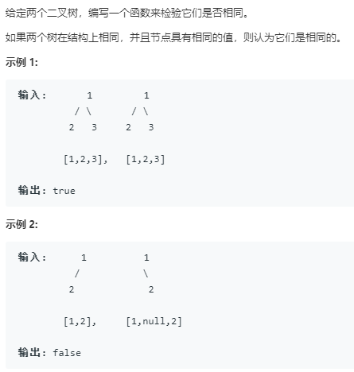
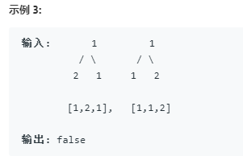

```python
# Definition for a binary tree node.
# class TreeNode:
#     def __init__(self, x):
#         self.val = x
#         self.left = None
#         self.right = None

class Solution:
    def isSameTree(self, p: TreeNode, q: TreeNode) -> bool:
        # 用递归的方法
        if p is None and q is None:
            return True
        if p is None or q is None:
            return False
        if p.val == q.val:
            return self.isSameTree(p.left,q.left) and self.isSameTree(p.right,q.right)
```

用队列的BFS
```python
# Definition for a binary tree node.
# class TreeNode:
#     def __init__(self, x):
#         self.val = x
#         self.left = None
#         self.right = None

class Solution:
    def isSameTree(self, p: TreeNode, q: TreeNode) -> bool:
        # 使用迭代的方法,DFS
        def check(p,q):
            if p is None and q is None:
                return True
            if p is None or q is None:
                return False
            if p.val == q.val:
                return True
            else:
                return False
        
        deq = [(p,q)]
        while deq:
            p,q = deq.pop(0)
            if not check(p,q):
                return False
            if p:
                deq.append((p.left,q.left))
                deq.append((p.right,q.right))
        return True
```

使用栈的DFS
```python
# Definition for a binary tree node.
# class TreeNode:
#     def __init__(self, x):
#         self.val = x
#         self.left = None
#         self.right = None

class Solution:
    def isSameTree(self, p: TreeNode, q: TreeNode) -> bool:
        # 使用迭代的方法,DFS
        def check(p,q):
            if p is None and q is None:
                return True
            if p is None or q is None:
                return False
            if p.val == q.val:
                return True
            else:
                return False
        
        stack = [(p,q)]
        while stack:
            p,q = stack.pop()
            if not check(p,q):
                return False
            if p:
                stack.append((p.left,q.left))
                stack.append((p.right,q.right))
        return True
```
