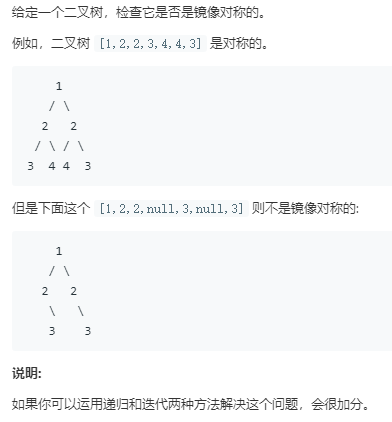

```python
# Definition for a binary tree node.
# class TreeNode:
#     def __init__(self, x):
#         self.val = x
#         self.left = None
#         self.right = None

class Solution:
    def isSymmetric(self, root: TreeNode) -> bool:
        if not root:
            return True
        return self.DFS(root.left,root.right)
    def recurse(self,node1,node2):
        if node1 is None and node2 is None:
            return True
        if node1 is None or node2 is None:
            return False
        if node1.val == node2.val:
            return self.recurse(node1.left,node2.right) and self.recurse(node1.right,node2.left)
        else:
            return False
    
    def DFS(self,node1,node2):
        stack = [(node1,node2)]
        while stack:
            nd1,nd2 = stack.pop()
            if nd1 is None and nd2 is None:
                continue
            if nd1 is None or nd2 is None:
                return False
            if nd1.val == nd2.val:
                stack.append((nd1.left,nd2.right))
                stack.append((nd1.right,nd2.left))
            else:
                return False
        return True
        
```
