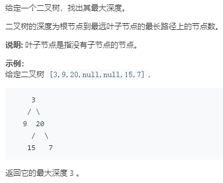

```python
# Definition for a binary tree node.
# class TreeNode:
#     def __init__(self, x):
#         self.val = x
#         self.left = None
#         self.right = None

class Solution:
    def maxDepth(self, root: TreeNode) -> int:
        # 直接求每个节点的深度
        if not root:
            return 0
        self.recurse(root)
        return self.max_depth
    def iter_(self,root):
        stack = [(root,1)]
        max_depth = 0
        while stack:
            root,depth = stack.pop()
            if max_depth < depth:
                max_depth = depth
            if root.left:
                stack.append((root.left,depth+1))
            if root.right:
                stack.append((root.right,depth+1))
        return max_depth
    
    def recurse(self,root):
        self.max_depth = 0
        depth = 1
        def recurse(root,depth):
            if self.max_depth<depth:
                self.max_depth = depth
            if root.left:
                recurse(root.left,depth+1)
            if root.right:
                recurse(root.right,depth+1)
        recurse(root,depth)
```
