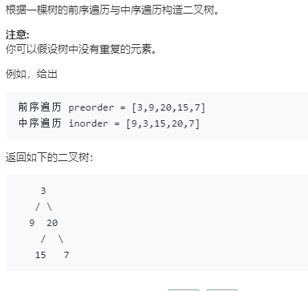

```python
# Definition for a binary tree node.
# class TreeNode:
#     def __init__(self, x):
#         self.val = x
#         self.left = None
#         self.right = None

class Solution:
    def buildTree(self, preorder: List[int], inorder: List[int]) -> TreeNode:
        root = self.recurse(preorder,inorder)
        return root
    def recurse(self,pre,in_):
        if not pre:
            return None
        root = TreeNode(pre[0])
        i = 0
        while in_[i] != pre[0]:
            i += 1
        root.left = self.recurse(pre[1:i+1],in_[:i])
        root.right = self.recurse(pre[i+1:],in_[i+1:])
        return root
```
