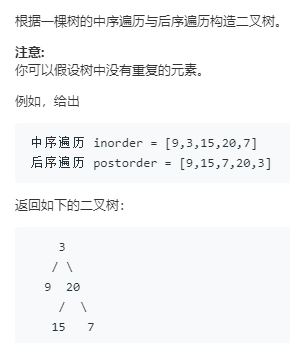

```python
# Definition for a binary tree node.
# class TreeNode:
#     def __init__(self, x):
#         self.val = x
#         self.left = None
#         self.right = None

class Solution:
    def buildTree(self, inorder: List[int], postorder: List[int]) -> TreeNode:
        return self.recurse(inorder,postorder)
    
    def recurse(self,in_,post):
        if not in_:
            return None
        root = TreeNode(post[-1])
        i = 0
        while in_[i] != post[-1]:
            i += 1
        root.left = self.recurse(in_[:i],post[:i])
        root.right = self.recurse(in_[i+1:],post[i:-1])
        return root
```

待学习:

用迭代的方法即用栈来完成
