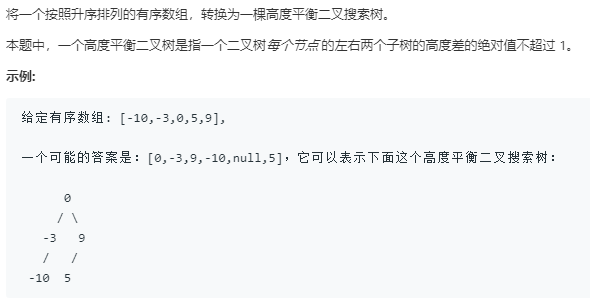

```python
# Definition for a binary tree node.
# class TreeNode:
#     def __init__(self, x):
#         self.val = x
#         self.left = None
#         self.right = None

class Solution:
    def sortedArrayToBST(self, nums: List[int]) -> TreeNode:
        return self.BFS(nums)
    
    def recurse(self,nums,start,end):
        # 递归基
        if start == end:
            return None
        mid = (start+end)>>1
        root = TreeNode(nums[mid])
        root.left = self.recurse(nums,start,mid)
        root.right = self.recurse(nums,mid+1,end)
        return root
    
    def BFS(self,nums):
        n = len(nums)
        mid = n>>1
        root = TreeNode(nums[mid])
        queue = [(root,mid,0,n)]
        while queue:
            node,mid,start,end = queue.pop(0)

            if start < mid:
                mid_l = (start+mid)>>1
                left = TreeNode(nums[mid_l])
                queue.append((left,mid_l,start,mid))
            else:
                left = None
            if mid<end:
                mid_r = (mid+end)>>1
                right = TreeNode(nums[mid_r])
                queue.append((right,mid_r,mid,end))
            else:
                right = None
            node.left = left
            node.right = right
        return root
```
