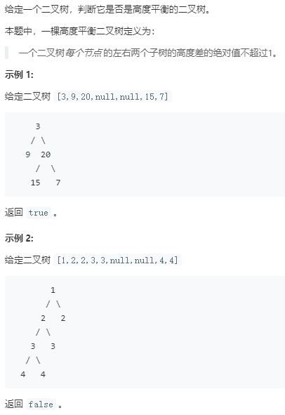

```python
# Definition for a binary tree node.
# class TreeNode:
#     def __init__(self, x):
#         self.val = x
#         self.left = None
#         self.right = None

class Solution:
    def isBalanced(self, root: TreeNode) -> bool:
        self.res = True
        self.recurse(root)
        return self.res
    
    def recurse(self,root):
        if root is None:
            return 0
        left = self.recurse(root.left)+1
        right = self.recurse(root.right)+1
        if abs(left-right) > 1:
            self.res = False
        high = max(left,right)
        return high
```
