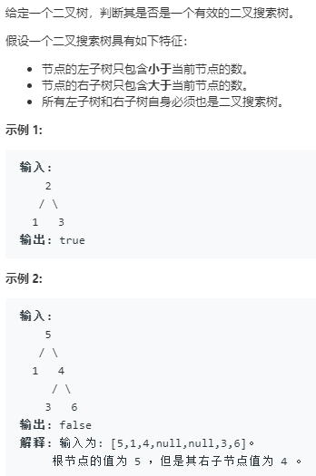

```python
# Definition for a binary tree node.
# class TreeNode:
#     def __init__(self, x):
#         self.val = x
#         self.left = None
#         self.right = None

class Solution:
    def isValidBST(self, root: TreeNode) -> bool:
        return self.BFS(root)
    
    def recurse(self,root):
        def recurse_(node,lower,upper):
            # 递归基
            if node is None:
                return True
            # 判断是否在区间之中
            val = node.val
            if lower is not None and lower>=val:
                return False
            if upper is not None and upper<=val:
                return False
            return recurse_(node.left,lower,val) and recurse_(node.right,val,upper)
        return recurse_(root,None,None)
    
    def DFS(self,root):
        queue = [(root,None,None)]
        while queue:
            node,lower,upper = queue.pop()
            if node is None:
                continue
            val = node.val
            if lower is not None and lower>=val:
                return False
            if upper is not None and upper<=val:
                return False
            queue.append((node.left,lower,val))
            queue.append((node.right,val,upper))
        return True
    
    def BFS(self,root):
        stack = [(root,None,None)]
        while stack:
            node,lower,upper = stack.pop()
            if node is None:
                continue
            val = node.val
            if lower is not None and lower>=val:
                return False
            if upper is not None and upper<=val:
                return False
            stack.append((node.left,lower,val))
            stack.append((node.right,val,upper))
        return True
```
