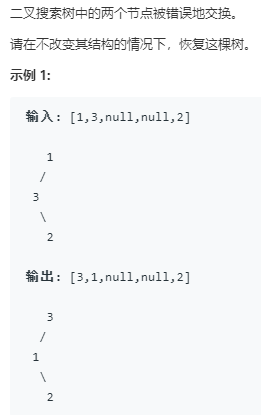
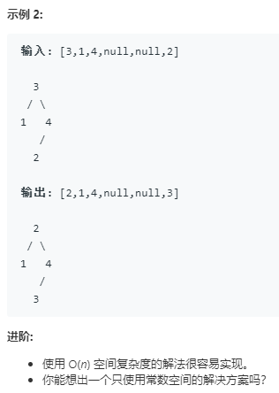

```python
# Definition for a binary tree node.
# class TreeNode:
#     def __init__(self, x):
#         self.val = x
#         self.left = None
#         self.right = None

class Solution:
    def recoverTree(self, root: TreeNode) -> None:
        """
        Do not return anything, modify root in-place instead.
        """
        firstNode = None
        secondNode = None
        pre = TreeNode(float("-inf"))

        stack = []
        p = root
        while p or stack:
            while p:
                stack.append(p)
                p = p.left
            p = stack.pop()
            
            if not firstNode and pre.val > p.val:
                    firstNode = pre
            if firstNode and pre.val > p.val:
                secondNode = p
            pre = p
            p = p.right
        firstNode.val, secondNode.val = secondNode.val, firstNode.val
```
