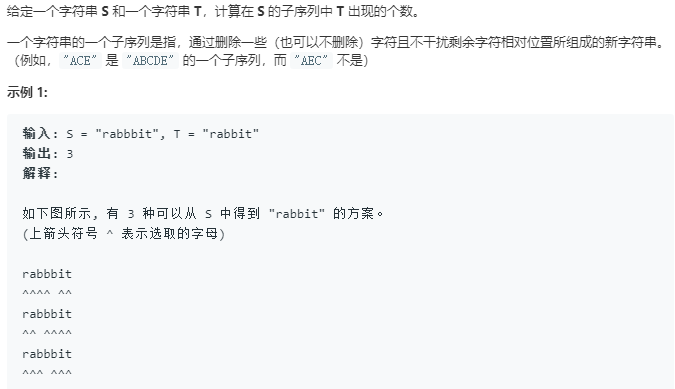
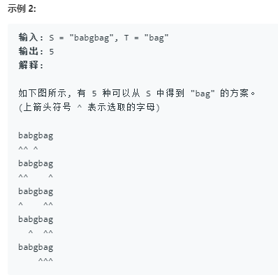

动态规划:
转态转移方程的由来:
当s[i]=t[j]时我们可以丢弃或者加长

```python
class Solution:
    def numDistinct(self, s: str, t: str) -> int:
        rows,cols = len(s),len(t)
        dp = [[0]*(cols+1) for _ in range(rows+1)]
        for row in range(rows+1):
            dp[row][0] = 1
        for col in range(1,cols+1):
            dp[0][col] = 0
        for i in range(1,rows+1):
            for j in range(1,cols+1):
                if s[i-1] == t[j-1]:
                    dp[i][j] = dp[i-1][j-1] + dp[i-1][j]
                else:
                    dp[i][j] = dp[i-1][j]
        return dp[rows][cols]
```
