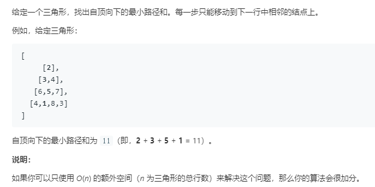

```python
class Solution:
    def minimumTotal(self, triangle: List[List[int]]) -> int:
        rows,cols = len(triangle),len(triangle[-1])
        dp = [0]*(cols)
        for col in range(cols):
            dp[col] = triangle[-1][col]
        for row in range(rows-2,-1,-1):
            for col in range(row+1):
                dp[col] = min(dp[col],dp[col+1])+triangle[row][col]
        return dp[0]
```
