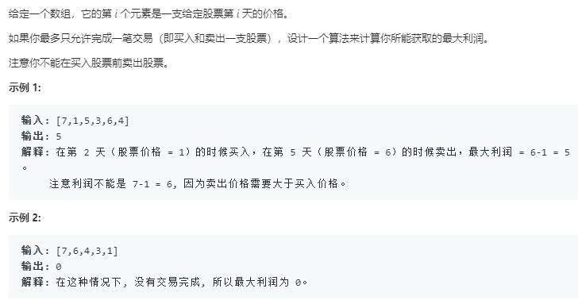

```python
class Solution:
    def maxProfit(self, prices: List[int]) -> int:
        dp_i_0_0 = 0
        dp_i_1_0 = 0
        dp_i_1_1 = float('-inf')
        for price in prices:
            dp_i_1_0 = max(dp_i_1_0,dp_i_1_1 + price)
            dp_i_1_1 = max(dp_i_1_1,dp_i_0_0 - price)
        return dp_i_1_0
```
