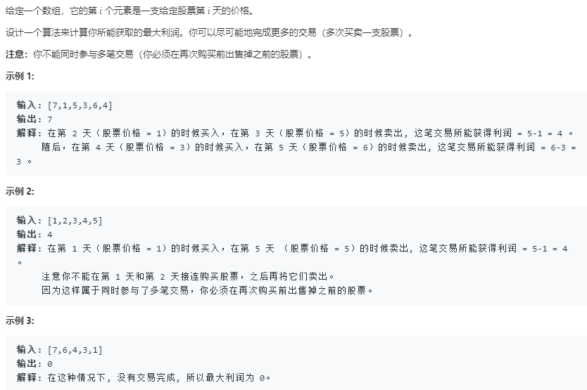

```python
class Solution:
    def maxProfit(self, prices: List[int]) -> int:
        if not prices:
            return 0
        min_p = prices[0]
        prev = prices[0]
        max_ = 0
        for p in prices[1:]:
            if prev <= p:
                prev = p
            else:
                max_ += prev-min_p
                min_p = p
                prev = min_p
        return max_+prev-min_p
```
