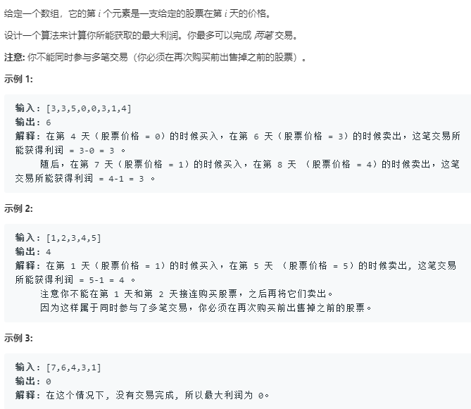

[题解](https://leetcode-cn.com/problems/best-time-to-buy-and-sell-stock-iii/solution/yi-ge-tong-yong-fang-fa-tuan-mie-6-dao-gu-piao-wen/)



做动态规划问题的时候只考虑状态是怎么转移的，而不考虑最不最优，相信它求解出来的问题一定是最优的

```python
class Solution:
    def maxProfit(self, prices: List[int]) -> int:
        """三个状态变量, 第i天, 进行了k次交易, 手上有无股票"""
        if not prices:
            return 0
        k = 2
        xs,ys,zs = len(prices),k,2
        dp = [[[0]*zs for _ in range(ys+1)] for _ in range(xs+1)]
        for x in range(xs+1):
            dp[x][0][0] = 0
            dp[x][0][1] = float('-inf')
        for y in range(ys+1):
            dp[0][y][0] = 0
            dp[0][y][1] = float('-inf')
        for x in range(1,xs+1):
            for y in range(1,ys+1):
                dp[x][y][0] = max(dp[x-1][y][0],dp[x-1][y][1]+prices[x-1])
                dp[x][y][1] = max(dp[x-1][y][1],dp[x-1][y-1][0]-prices[x-1])
        return dp[xs][ys][0]
```

```python
class Solution:
    def maxProfit(self, prices: List[int]) -> int:
        """三个状态变量, 第i天, 进行了k次交易, 手上有无股票"""
        # if not prices:
        #     return 0
        k = 2
        xs,ys,zs = len(prices),k,2
        dp = [[[0]*zs for _ in range(ys+1)] for _ in range(xs+1)]
        # for x in range(xs+1):
        #     dp[x][0][0] = 0
        #     dp[x][0][1] = float('-inf')
        # for y in range(ys+1):
        #     dp[0][y][0] = 0
        #     dp[0][y][1] = float('-inf')
        for x in range(0,xs+1):
            for y in range(0,ys+1):
                # 处理base情况
                if y==0:
                    dp[x][0][0] = 0
                    dp[x][0][1] = float('-inf')
                elif x == 0:
                    dp[0][y][0] = 0
                    dp[0][y][1] = float('-inf')
                else:
                    dp[x][y][0] = max(dp[x-1][y][0],dp[x-1][y][1]+prices[x-1])
                    dp[x][y][1] = max(dp[x-1][y][1],dp[x-1][y-1][0]-prices[x-1])
        return dp[xs][ys][0]
```

```python
class Solution:
    def maxProfit(self, prices: List[int]) -> int:
        """三个状态变量, 第i天, 进行了k次交易, 手上有无股票"""
        # if not prices:
        #     return 0
        dp_i_2_0 = 0
        dp_i_2_1 = float('-inf')
        dp_i_1_0 = 0
        dp_i_1_1 = float('-inf')
        dp_i_0_0 = 0
        for price in prices:
            dp_i_2_0 = max(dp_i_2_0,dp_i_2_1+price)
            dp_i_2_1 = max(dp_i_2_1,dp_i_1_0-price)
            dp_i_1_0 = max(dp_i_1_0,dp_i_1_1+price)
            dp_i_1_1 = max(dp_i_1_1,dp_i_0_0-price)
        return dp_i_2_0
```
