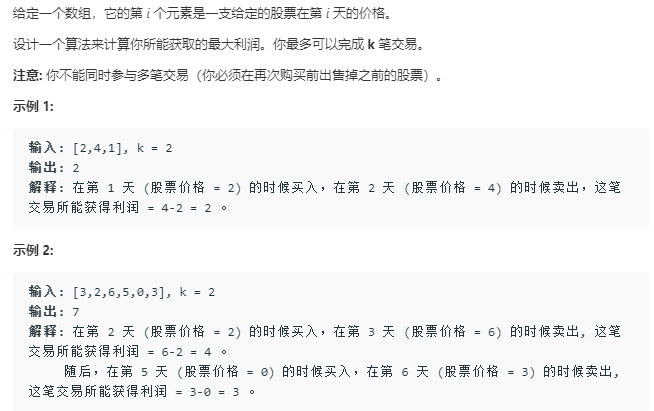

到底在求什么:
i: 第i天
k: 到达第i天时交易了k次
0 1 表示手头有股票吗:

i,k,0: 表示 在第i天时购买了j次,目前没有股票在手上
- 两种到达方式：i-1天什么都不做 j,k,
- i-1天将股票卖出
从这两种方式之中选择最优的一种方式

i,k,1 表示第i天购买了k次，目前用有股票在手上
- i-1天什么都不做
- i-1天股票买进
从这两种状态转移方式中选择其中最优的一种方式

```python
class Solution:
    def maxProfit(self, k: int, prices: List[int]) -> int:
        if k>len(prices)/2:
            return self.maxProfit_(prices)
        xs,ys = len(prices)+1,k+1
        dp = [[[0]*2 for _ in range(ys)] for _ in range(xs)]
        for x in range(xs):
            for y in range(ys):
                if x == 0:
                    dp[x][y][0] = 0
                    dp[x][y][1] = float('-inf')
                elif y == 0:
                    dp[x][y][0] = 0
                    dp[x][y][1] = float('-inf')
                else:
                    dp[x][y][0] = max(dp[x-1][y][0],dp[x-1][y][1]+prices[x-1])  # 
                    dp[x][y][1] = max(dp[x-1][y][1],dp[x-1][y-1][0]-prices[x-1])
        return dp[xs-1][ys-1][0]
    
    def maxProfit_(self, prices: List[int]) -> int:
        if not prices:
            return 0
        min_p = prices[0]
        prev = prices[0]
        max_ = 0
        for p in prices[1:]:
            if prev <= p:
                prev = p
            else:
                max_ += prev-min_p
                min_p = p
                prev = min_p
        return max_+prev-min_p
```
