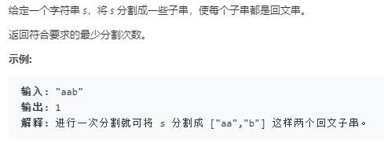

```python
class Solution:
    def minCut(self, s: str) -> int:
        n = len(s)
        p = [[False]*n for _ in range(n)]
        cuts = list(range(-1,n))
        for i in range(0,n):
            for j in range(i+1):
                if i == j:
                    p[i][j] = True
                if s[i] == s[j] and (i-j<2 or p[i-1][j+1]):
                    p[i][j] = True
                    cuts[i+1] = min(cuts[i+1],cuts[j]+1)
        return cuts[n]
```

高级的解法
```python
class Solution:
    def minCut(self, s: str) -> int:
        n = len(s)
        cuts = list(range(-1,n))
        for i in range(0,n):
            odd = 0
            while 0<=i-odd and i+odd<n and s[i-odd] == s[i+odd]:
                # 加1的原因是 i+odd表示原s的index,而长度要加1
                cuts[i+odd+1] = min(cuts[i+odd+1],cuts[i-odd]+1) # 而这里就是i-odd不减1
                odd += 1
            even = 1
            while 0<=i-even+1 and i+even<n and s[i-even+1] == s[i+even]:
                cuts[i+even+1] = min(cuts[i+even+1],cuts[i-even+1]+1)
                even += 1
        return cuts[n]
```
