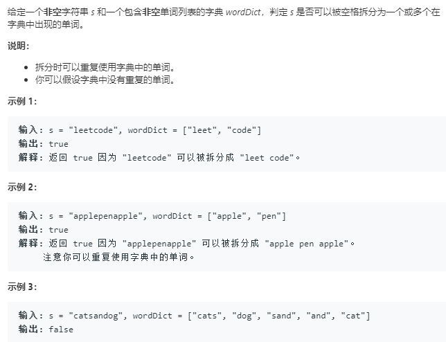

```python
class Solution:
    def wordBreak(self, s: str, wordDict: List[str]) -> bool:
        n = len(s)
        dp = [False]*(n+1)
        for i in range(n):
            for j in range(i+1):
                if s[j:i+1] in wordDict and (j==0 or dp[j-1]):
                    dp[i] = True
                    break
        return dp[n-1]
```
