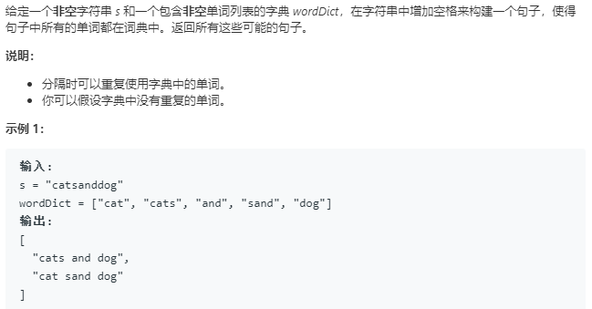
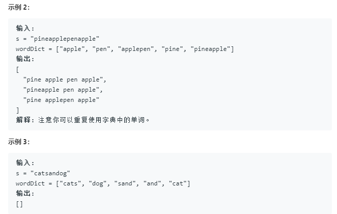

```python
class Solution:
    def wordBreak(self, s: str, wordDict: List[str]) -> List[str]:
        
        def recurse(s,mem):
            # next_place停止的地方
            if not s:
                return ['']
            if s in mem:
                return mem[s]
            
            res = []
            for word in wordDict:
                # could_place?
                if word == s[:len(word)]:
                    # next_place(包含backtracking函数, 而backtracking又包含next_place)
                    ne_res = recurse(s[len(word):],mem)
                    for ne_res_ in ne_res:
                        res.append(word+(' ' if ne_res_ else '')+ne_res_)
            mem[s] = res
            return res        
        mem = {}
        recurse(s,mem)
        return mem[s]
```
