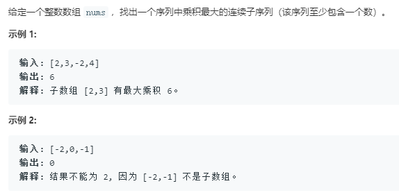

属于技巧较多的题目
```python
class Solution:
    def maxProduct(self, nums: List[int]) -> int:
        """先求以i为结尾的连乘最大值"""
        max_ = float('-inf')
        cmax = 1
        cmin = 1
        for num in nums:
            # 负数会使符号相反，最大变最小的最大的变最小的，遇到了0都同时终止
            if num < 0:
                cmin,cmax = cmax,cmin
            cmin = min(cmin*num,num)
            cmax = max(cmax*num,num)
            max_ = max(cmax,max_)
        return max_
```
