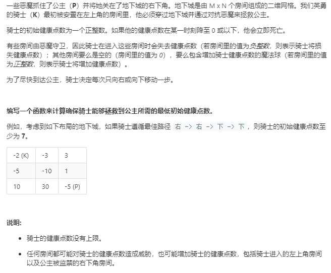

从大的index到小的index

```python
class Solution:
    def calculateMinimumHP(self, dungeon: List[List[int]]) -> int:
        rows,cols = len(dungeon),len(dungeon[0])
        dp = [[0]*(cols) for _ in range(rows)]
        for row in range(rows-1,-1,-1):
            for col in range(cols-1,-1,-1):
                # 如果在公主处
                if row == rows-1 and col == cols-1:
                    dp[row][col] = 1 if dungeon[row][col]>=0 else -dungeon[row][col]+1
                elif row == rows-1:
                    need = dp[row][col+1] - dungeon[row][col] # row, col+1 处的需要，当前有的，如果当前有的能满足前面的需要，则可以 前面最少应该还有1
                    dp[row][col] = 1 if need<=0 else need 
                elif col == cols-1:
                    need = dp[row+1][col] - dungeon[row][col]
                    dp[row][col] = 1 if need<=0 else need
                else:
                    need = min(dp[row][col+1],dp[row+1][col])-dungeon[row][col]
                    dp[row][col] = 1 if need<=0 else need
        return dp[0][0]
```
