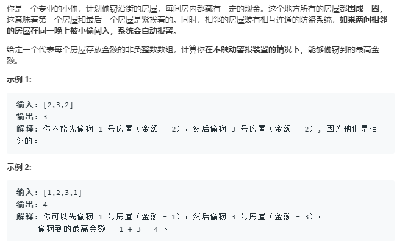

```python
class Solution:
    def rob(self, nums: List[int]) -> int:
        if not nums:
            return 0
        n = len(nums)
        if n == 1:
            return nums[0]
        if n == 2:
            return max(nums[0],nums[1])
        dp = [0]*(len(nums)-1)
        dp[0] = nums[0]
        dp[1] = max(nums[0],nums[1])
        for i in range(2,n-1):
            dp[i] = max(dp[i-2]+nums[i],dp[i-1])
        max_ = dp[n-2]
        dp[0] = nums[1]
        dp[1] = max(nums[1],nums[2])
        for i in range(3,n):
            dp[i-1] = max(dp[i-3]+nums[i],dp[i-2])
        max_ = max(max_,dp[n-2])
        return max_
```
