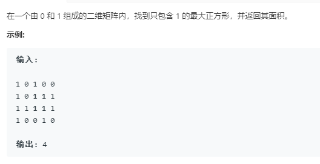

```python
class Solution:
    def maximalSquare(self, matrix: List[List[str]]) -> int:
        if not matrix:
            return 0
        rows = len(matrix)
        cols = len(matrix[0])
        dp = [[0]*cols for _ in range(rows)]
        max_ = 0
        for row in range(rows):
            for col in range(cols):
                if row == '0' or col == '0':
                    if matrix[row][col] == '1':
                        dp[row][col] = 1
                    else:
                        dp[row][col] = 0
                else:
                    if matrix[row][col] == '1':
                        dp[row][col] = min(dp[row-1][col],dp[row][col-1],dp[row-1][col-1])+1
                    else:
                        dp[row][col] = 0
                max_ = max(dp[row][col],max_)
        return max_*max_
```
