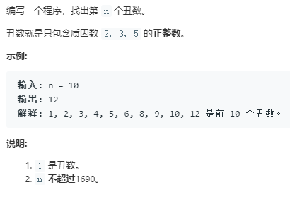

```python
class Solution:
    def nthUglyNumber(self, n: int) -> int:
        id_2 = 0
        id_3 = 0
        id_5 = 0
        dp = [1]
        n1 = n
        while n>0:
            val_2 = dp[id_2]*2
            val_3 = dp[id_3]*3
            val_5 = dp[id_5]*5
            curr = min(val_2,val_3,val_5)
            dp.append(curr)
            while dp[id_2]*2 <= curr:
                id_2 += 1
            while dp[id_3]*3 <= curr:
                id_3 += 1
            while dp[id_5]*5 <= curr:
                id_5 += 1
            n -= 1
            
        print(dp)
        return dp[n1-1]
```
