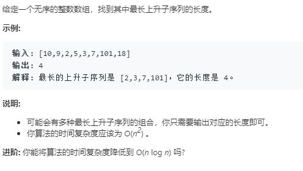

O(n)
```python
class Solution:
    def lengthOfLIS(self, nums: List[int]) -> int:
        if not nums:
            return 0
        n = len(nums)
        dp = [0]*n
        dp[0] = 1
        for i in range(1,n):
            dp[i] = 1
            for j in range(i):
                if nums[j]<nums[i]:
                    dp[i] = max(dp[i],dp[j]+1)
        return max(dp)
```

O(nlogn)
比较巧妙 二分查找
```python
class Solution:
    def lengthOfLIS(self, nums: List[int]) -> int:
        inc = []
        for i in range(len(nums)):
            if i == 0 or inc[-1]<nums[i]:
                inc.append(nums[i])
            else:
                start = 0
                end = len(inc)
                while start<end:
                    mid = (start+end)//2
                    if inc[mid]<nums[i]:
                        # mid要小
                        start = mid+1
                    else:
                        # mid要比此数大大
                        end = mid
                inc[start] = nums[i]
        return len(inc)
```

```python
import bisect
class Solution:
    def lengthOfLIS(self, nums: List[int]) -> int:
        inc = []
        for i in range(len(nums)):
                index = bisect.bisect_left(inc,nums[i]) # 最左边的元素，bisect返回的是最右边的
                if index == len(inc):
                    inc.append(nums[i])
                else:
                    inc[index] = nums[i]
        return len(inc)
```
