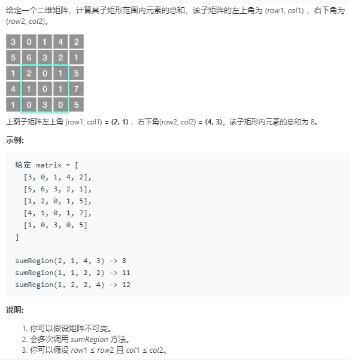

```python
class NumMatrix:

    def __init__(self, matrix: List[List[int]]):
        if not matrix:
            return None
        rows = len(matrix)
        cols = len(matrix[0])
        self.sums = [[0]*(cols+1) for _ in range(rows+1)]
        for row in range(rows):
            for col in range(cols):
                self.sums[row+1][col+1] = self.sums[row][col+1]\
                                            +self.sums[row+1][col]-self.sums[row][col]+matrix[row][col]

    def sumRegion(self, row1: int, col1: int, row2: int, col2: int) -> int:
        return self.sums[row2+1][col2+1]-self.sums[row1][col2+1]-self.sums[row2+1][col1]+self.sums[row1][col1]


# Your NumMatrix object will be instantiated and called as such:
# obj = NumMatrix(matrix)
# param_1 = obj.sumRegion(row1,col1,row2,col2)
```
