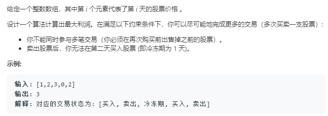

```python

class Solution:
    def maxProfit(self, prices: List[int]) -> int:
        xs = len(prices)+1
        dp = [[0]*2 for _ in range(xs)]
        for i in range(xs):
            if i == 0:
                dp[i][0] = 0
                dp[i][1] = float('-inf')
            else:
                dp[i][0] = max(dp[i-1][0],dp[i-1][1]+prices[i-1])
                dp[i][1] = max(dp[i-1][1],dp[i-2][0]-prices[i-1])
        return dp[xs-1][0]
```

```python
class Solution:
    def maxProfit(self, prices: List[int]) -> int:
        dp_i_0 = 0
        dp_i_1 = float('-inf')
        dp_i_2 = 0
        for p in prices:
            temp = dp_i_0
            dp_i_0 = max(dp_i_0,dp_i_1+p)
            dp_i_1 = max(dp_i_1,dp_i_2-p)
            dp_i_2 = temp
        return dp_i_0
```
