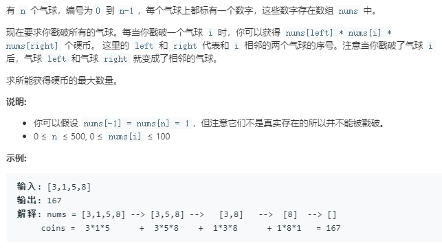
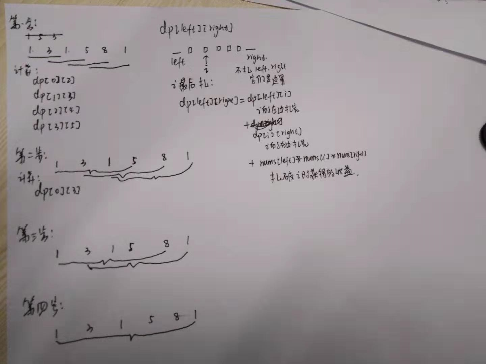

```python
class Solution:
    def maxCoins(self, nums: List[int]) -> int:
        nums = [1]+nums+[1]
        n = len(nums)
        dp = [[0]*(n+2) for _ in range(n+2)]
        for step in range(2,n):
            for left in range(0,n-step):
                right = left+step
                for i in range(left+1,right):
                    dp[left][right] = max(dp[left][right],
                                         dp[left][i]+nums[left]*nums[i]*nums[right]+dp[i][right])
        return dp[0][n-1]
```
