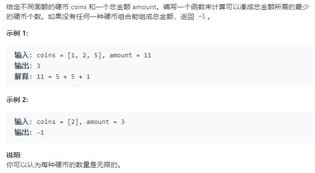

动态规划求解,或者带记忆的DFS求解

```python
class Solution:
    def coinChange(self, coins: List[int], amount: int) -> int:
        n = amount
        dp = [-1]*(n+1)
        dp[0] = 0
        for i in range(1,n+1):
            for coin in coins:
                if 0<=i-coin:
                    if dp[i-coin] != -1:
                        dp[i] = dp[i-coin]+1 if dp[i] == -1 else min(dp[i],dp[i-coin]+1)
        return dp[n]
```
