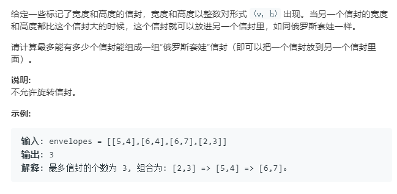

超时的写法
```python
class Solution:
    def maxEnvelopes(self, envelopes: List[List[int]]) -> int:
        if not envelopes:
            return 0
        envelopes = sorted(envelopes,key=lambda x:x[0])
        n = len(envelopes)
        dp = [1]*n
        for i in range(1,n):
            dp[i] = 1
            for j in range(i):
                if envelopes[j][0]<envelopes[i][0] and envelopes[j][1]<envelopes[i][1]:
                    dp[i] = max(dp[i],dp[j]+1)
        return max(dp)
```

增加二分的思想, 不超时
```python
import bisect
class Solution:
    def maxEnvelopes(self, envelopes: List[List[int]]) -> int:
        if not envelopes:
            return 0
        """ 此题的巧妙方法将第二个进行降序排序 """
        envelopes = sorted(envelopes,key=lambda x:(x[0],-x[1]))
        n = len(envelopes)
        res = []
        for i in range(n):
            index = bisect.bisect_left(res,envelopes[i][1])

            if index == len(res):
                res.append(envelopes[i][1])
            else:
                res[index] = envelopes[i][1]
        return len(res)
```
