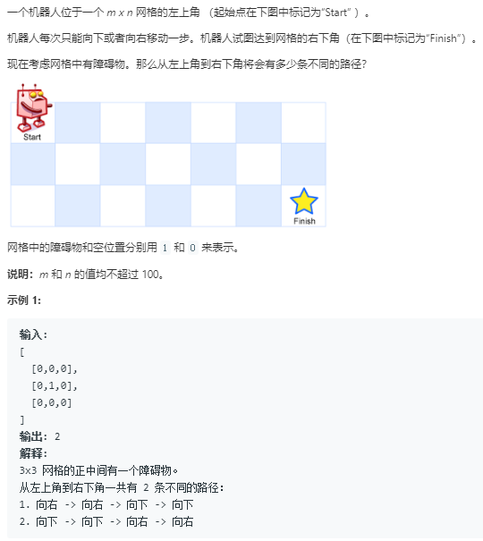

题目


```python
class Solution:
    def uniquePathsWithObstacles(self, obstacleGrid: List[List[int]]) -> int:
        rows,cols = len(obstacleGrid),len(obstacleGrid[0])
        dp = [[0 for _ in range(cols)] for _ in range(rows)]
        for row in range(rows):
            if obstacleGrid[row][0] != 1:
                dp[row][0] = 1
            else:
                break
        for col in range(cols):
            if obstacleGrid[0][col] != 1:
                dp[0][col] = 1
            else:
                break
        for row in range(1,rows):
            for col in range(1,cols):
                if obstacleGrid[row][col] == 1:
                    continue
                else:
                    dp[row][col] = dp[row][col-1] + dp[row-1][col]
        return dp[rows-1][cols-1]
```
