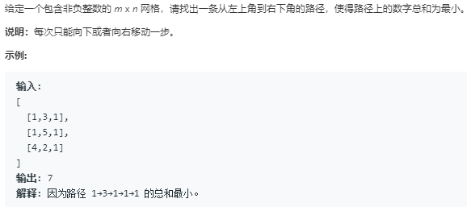

题目



代码

```python
class Solution:
    def minPathSum(self, grid: List[List[int]]) -> int:
        rows,cols = len(grid),len(grid[0])
        dp = [[0 for _ in range(cols)] for _ in range(rows)]
        dp[0][0] = grid[0][0]
        for i in range(rows):
            for j in range(cols):
                if i == j == 0:
                    dp[i][j] = grid[0][0]
                elif i == 0:
                    dp[i][j] = dp[i][j-1] + grid[i][j]
                elif j == 0:
                    dp[i][j] = dp[i-1][j] + grid[i][j]
                else:
                    dp[i][j] = min(dp[i-1][j],dp[i][j-1])+grid[i][j]
        return dp[rows-1][cols-1]
```
