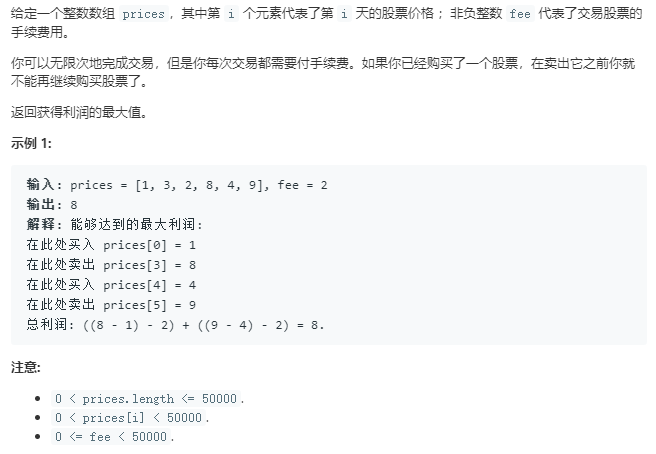

```python
class Solution:
    def maxProfit(self, prices: List[int], fee: int) -> int:
        dp_i_0 = 0
        dp_i_1 = float('-inf')
        
        for p in prices:
            temp = dp_i_0
            dp_i_0 = max(dp_i_0,dp_i_1+p-fee)
            dp_i_1 = max(dp_i_1,temp-p)
        return dp_i_0
```
