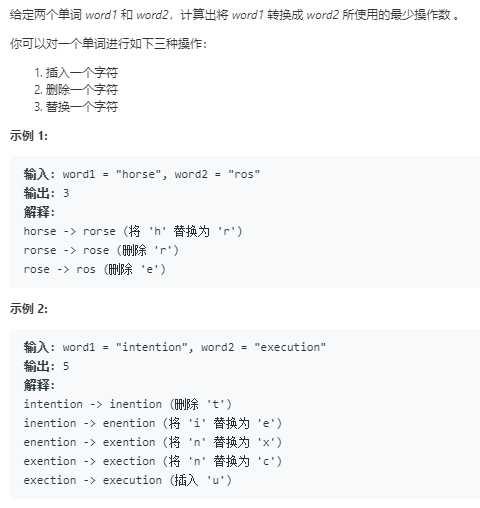

题目



代码
```python
class Solution:
    def minDistance(self, word1: str, word2: str) -> int:
        """使用动态规划求解"""
        """dp[i][j] 表示长度为i和长度为j两个字符串的编辑距离"""
        """关键在于找到到达dp[i][j]的路径"""
        """dp[i][j-1] --> dp[i][j] 添加"""
        """dp[i-1][j] --> dp[i][j] 删除"""
        """dp[i-1][j-1] --> 替换操作"""
        """找到从以前的节点到达i,j的路径"""
        l_1,l_2 = len(word1),len(word2)
        dp = [[0]*(l_2+1) for _ in range(l_1+1)]
        # 当i==0时要通过添加
        for j in range(l_2+1):
            dp[0][j] = j
        # 当j==0时通过删除来满足
        for i in range(l_1+1):
            dp[i][0] = i
        # 其他情况
        for i in range(1,l_1+1):
            for j in range(1,l_2+1):
                # 三种情况到达(i,j)
                # 删除
                if word1[i-1] == word2[j-1]:
                    dp[i][j] = min(dp[i-1][j]+1,dp[i][j-1]+1,dp[i-1][j-1]) # 删除，添加，
                else:
                    dp[i][j] = min(dp[i-1][j]+1,dp[i][j-1]+1,dp[i-1][j-1]+1) # 删除,添加,替换
        return dp[l_1][l_2]
```

