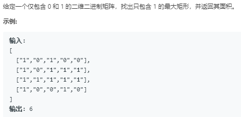

题目


```python
class Solution:
    def maximalRectangle(self, matrix: List[List[str]]) -> int:
        # 每层每层的计算最大面积,在每一层求解时将问题看成是一排直方图中找面积最大的矩阵
        if len(matrix) == 0:
            return 0
        dp = [0 for _ in range(len(matrix[0]))]
        max_area = 0
        for i in range(len(matrix)):
            # 遍历每一行
            for j in range(len(matrix[0])):
                # 遍历每一列更新dp
                dp[j] = dp[j] + 1 if matrix[i][j] == '1' else 0
            # 使用求解直方图的方法来求解
            max_area = max(max_area,self.zft(dp))
        return max_area
        
    def zft(self,dp):
        stack = [-1]
        max_area = 0
        for i in range(len(dp)):
            while stack[-1] != -1 and dp[i]<=dp[stack[-1]]:
                temp = stack.pop()
                max_area = max(max_area,dp[temp]*(i-stack[-1]-1))
            stack.append(i)
        
        while stack[-1] != -1:
            temp = stack.pop()
            max_area = max(max_area,dp[temp]*(len(dp)-stack[-1]-1))
        return max_area
```
