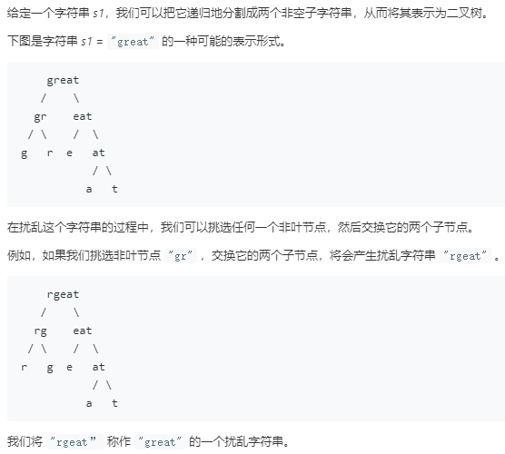
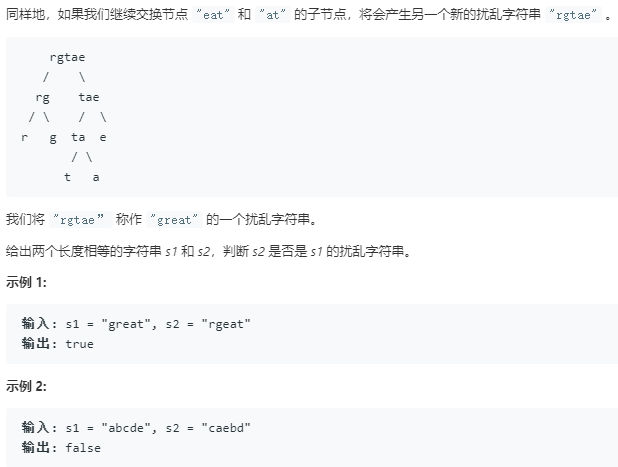

题目



[题解](https://leetcode-cn.com/problems/scramble-string/solution/xiang-xi-tong-su-de-si-lu-fen-xi-duo-jie-fa-by-1-2/)

代码1
```python
class Solution:
    def isScramble(self, s1: str, s2: str) -> bool:
        """递归的解法"""
        """
        递归的思想:
        将字符串s2的左部分是否时s1左半部分的scramble 同时 s1的右部分是否时s2右部分的scramble
        交换的情况：字符串s2的右部分是否时s1左半部分的scramble 同时 s1的左部分是否时s2右部分的scramble
        """
        n,m = len(s1),len(s2)
        # 递归基：两者长度不一致，包含的字符个数不一致, 直接返回False
        if sorted(s1) != sorted(s2):
            return False
        # 如果遇到两个字符串相等,直接返回，也即最后平凡的情况, 仅剩一个字符的时候
        if s1 == s2:
            return True
        # 普通情况
        for i in range(1,len(s1)):
            # 加if 与 不加 if的区别在于只有遇到True才返回，跳出循环，没有遇到那么就继续循环
            if ((self.isScramble(s1[:i],s2[:i]) and self.isScramble(s1[i:],s2[i:]))
                   or self.isScramble(s1[:i],s2[-i:]) and self.isScramble(s1[i:],s2[:-i])):
                return True
        return False
```


待学习:
带memorization的递归
```python
class Solution:
    def isScramble(self, s1: str, s2: str) -> bool:
        """使用带有memrization的递归的解法"""
        mem = {}
        return self.recurse(s1,s2,mem)
        
    def recurse(self,s1,s2,mem):
        ret = mem.get(s1+'#'+s2,-1)
        if ret == 0:
            return False
        elif ret == 1:
            return True
        n,m = len(s1),len(s2)
        if sorted(s1) != sorted(s2):
            mem[s1+'#'+s2] = 0
            return False
        # 递归
        if s1 == s2:
            mem[s1+'#'+s2] = 1
            return True
        for i in range(1,len(s1)):
            # 加if 与 不加 if的区别在于只有遇到True才返回，跳出循环，没有遇到那么就继续循环
            if ((self.isScramble(s1[:i],s2[:i]) and self.isScramble(s1[i:],s2[i:]))
                   or self.isScramble(s1[:i],s2[-i:]) and self.isScramble(s1[i:],s2[:-i])):
                mem[s1+'#'+s2] = 1
                return True
        mem[s1+'#'+s2] = 0
        return False
```
