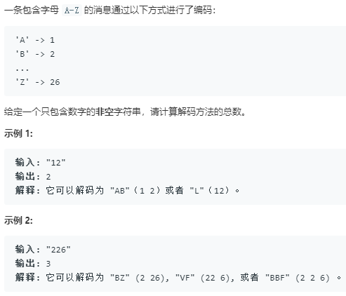

题目



动态规划解法:
关键: 是找到转移到状态i的路径：前面的状态怎样转移到i，需要哪些判断条件

```python
class Solution:
    def numDecodings(self, s: str) -> int:
        if s[0] == '0':
            return 0
        dp = [0]*(len(s)+1)
        dp[0] = 1
        dp[1] = 1
        for i in range(1,len(s)):
            if s[i-1] not in ['1','2'] and s[i]!='0':
                dp[i+1] = dp[i]
            elif s[i-1] == '1' and s[i] != '0':
                dp[i+1] = dp[i-1]+dp[i]
            elif s[i-1] == '2' and '0'<s[i]<'7':
                dp[i+1] = dp[i-1]+dp[i]
            elif s[i-1] in ['1','2'] and s[i] == '0':
                dp[i+1] = dp[i-1]
            elif s[i-1] == '2' and s[i]>='7':
                dp[i+1] = dp[i]
            elif s[i-1] == '0' and s[i] == '0':
                return 0
        return dp[len(s)]
```
