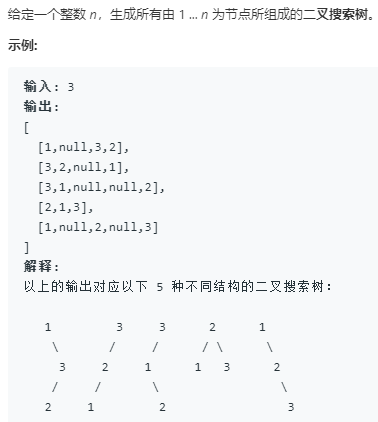

题目


输出具体的树结构

用递归的解法，注意这里返回的是根节点的数组,而不是实际的题目显示的那样形式
笔试的时候该怎么做呢？
递归是在从第向上构建所有的树，
```python
# Definition for a binary tree node.
# class TreeNode:
#     def __init__(self, x):
#         self.val = x
#         self.left = None
#         self.right = None

class Solution:
    def generateTrees(self, n: int) -> List[TreeNode]:
        # 返回值为每一颗树的根节点
        def recurse(start,end):
            # 递归基就是start与end相等或者start>end
            if start > end:
                return [None]
            all_trees = []
            for i in range(start,end+1):
                left_trees = recurse(start,i-1)
                right_trees = recurse(i+1,end)
                for l in left_trees:
                    for r in right_trees:
                        curr = TreeNode(i)
                        curr.left = l
                        curr.right = r
                        all_trees.append(curr)
            return all_trees
        return recurse(1,n) if n>0 else []
```

用动态规划的方法进行求解
未完成
