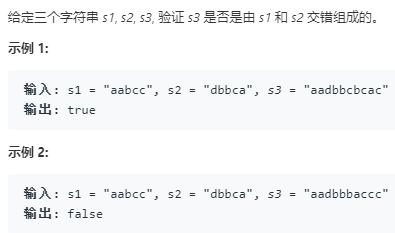

动态规划方法 与字符串的编辑距离有相似之处，相似的解决方式
```python
class Solution:
    def isInterleave(self, s1: str, s2: str, s3: str) -> bool:
        """处理输入异常的情况"""
        l_1,l_2,l_3 = len(s1),len(s2),len(s3)
        if l_1+l_2 != l_3:
            return False
        dp = [[True]*(l_2+1) for _ in range(l_1+1)]
        for row in range(l_1+1):
            for col in range(l_2+1):
                if row == col == 0:
                    dp[row][col] = True
                elif row == 0:
                    dp[row][col] = dp[row][col-1] and s2[col-1] == s3[row+col-1]
                elif col == 0:
                    dp[row][col] = dp[row-1][col] and s1[row-1] == s3[row+col-1]
                else:
                    dp[row][col] = dp[row-1][col] and s1[row-1] == s3[row+col-1] or \
                                    dp[row][col-1] and s2[col-1] == s3[row+col-1]
        return dp[l_1][l_2]
```

这种形式的问题用DFS和BFS来求解时的代码写法


DFS 用辅助栈 先进后出
```python
class Solution:
    def isInterleave(self, s1: str, s2: str, s3: str) -> bool:
        """处理输入异常的情况"""
        l_1,l_2,l_3 = len(s1),len(s2),len(s3)
        # 使用深度优先的算法
        if l_1 + l_2 != l_3:
            return False
        stack,visited = [(0,0)],set((0,0))
        while stack: #空的直接判断
            x,y = stack.pop()
            if x+y == l_3:
                return True
            # 进栈的条件
            if x<l_1 and s1[x]==s3[x+y] and (x+1,y) not in visited: # 判断当前，预先压进下一个而不进行判断
                stack.append((x+1,y))
                visited.add((x+1,y))
            if y<l_2 and s2[y]==s3[x+y] and (x,y+1) not in visited:
                visited.add((x,y+1))
                stack.append((x,y+1))
        return False
```

BFS 用辅助队列 queue先进先出
```python
class Solution:
    def isInterleave(self, s1: str, s2: str, s3: str) -> bool:
        """处理输入异常的情况"""
        l_1,l_2,l_3 = len(s1),len(s2),len(s3)
        # 使用深度优先的算法
        if l_1 + l_2 != l_3:
            return False
        queue,visited = [(0,0)],set((0,0))
        while queue: #空的直接判断
            x,y = queue.pop(0)
            if x+y == l_3:
                return True
            # 进栈的条件
            if x<l_1 and s1[x]==s3[x+y] and (x+1,y) not in visited:
                queue.append((x+1,y))
                visited.add((x+1,y))
            if y<l_2 and s2[y]==s3[x+y] and (x,y+1) not in visited:
                visited.add((x,y+1))
                queue.append((x,y+1))
        return False
```
