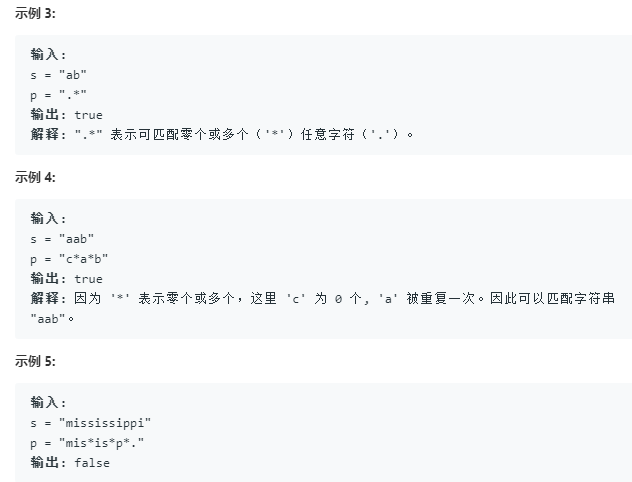

**很难**
递归实现回溯法
- 退化为空
- 退化为一个字符
- p至少两个字符: 第二个为*(匹配多次或者零次)，第二个不为*，第一个必须匹配，然后递归

```python
class Solution:
    def isMatch(self, s: str, p: str) -> bool:
        """divide and conquer"""
        """递归来解决"""
        """找到递归基"""
        if not p:
            return not s
        if len(p) == 1:
            return len(s) == 1 and (p[0] in [s[0],'.'])
        # 大于两个字符时
        if p[1] != '*':
            # 如果不等于*此时就需要硬核匹配了
            if not s: return False
            if p[0] in ['.',s[0]]:
                return self.isMatch(s[1:],p[1:])
            else:
                return False
        # 在这之前已经保证了p的元素至少是两个, 无论是循环中的递归再次调用
        while s and p[0] in ['.',s[0]]:
            # 如果遇到了 第二个为'*'
            """要么匹配0次--> 成功的话则直接返回True,要么匹配很多次，while就是实现重复使用多次的功能"""
            if self.isMatch(s,p[2:]):
                return True
            s = s[1:] #匹配多次
        """直到s缩减到s的首字符与p的首字符不相等的情况, 此时应该，匹配零次"""
        return self.isMatch(s,p[2:])
```


[动态规划](https://leetcode.com/problems/regular-expression-matching/discuss/5651/Easy-DP-Java-Solution-with-detailed-Explanation)
```python
class Solution:
    def isMatch(self, s: str, p: str) -> bool:
        """divide and conquer"""
        """递归来解决"""
        """找到递归基"""
        if not s and not p:
            return True
        if s and not p:
            return False
        dp = [[False]*(len(p)+1) for _ in range(len(s)+1)]
        dp[0][0] = True
        if p[0] == '*':
            dp[0][1] = True
        for i in range(1,len(p)):
            if p[i]=='*' and dp[0][i-1]:
                dp[0][i+1] = True
        for i in range(len(s)):
            for j in range(len(p)):
                if p[j] in ['.',s[i]]:
                    dp[i+1][j+1] = dp[i][j]
                """如果遇到*就要考虑回溯的情况了"""
                if p[j] == '*':
                    """如果前面的i和j-1字符不相等 此时无法重复"""
                    if p[j-1] != s[i] and p[j-1] != '.':
                        dp[i+1][j+1] = dp[i+1][j-1] #丢弃两个字符，重复0次
                    else:
                        """关键在于怎么表达重复0次，重复1次，重复多次"""
                        """0次"""
                        zero = dp[i+1][j-1]
                        """1次, 即*位置没有字符"""
                        one = dp[i+1][j]
                        """多次 即i位置的字符是前面的字符重复而来的"""
                        multip = dp[i][j+1]
                        dp[i+1][j+1] = zero or one or multip
        return dp[len(s)][len(p)]
```
