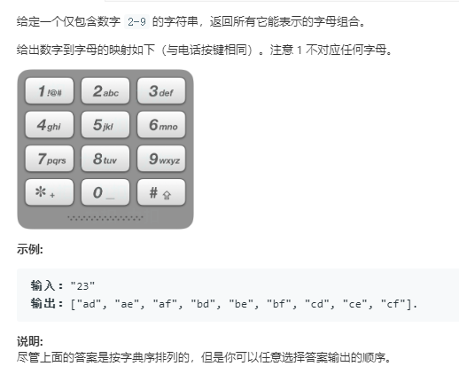

```python
class Solution:
    def letterCombinations(self, digits: str) -> List[str]:
        dic = {'2':['a','b','c'],'3':['d','e','f'],'4':['g','h','i'],'5':['j','k','l'],
              '6':['m','n','o'],'7':['p','q','r','s'],'8':['t','u','v'],'9':['w','x','y','z']}
        self.res = []
        for dig in digits:
            if dig == '1':
                continue
            if not self.res:
                for ch in dic[dig]:
                    self.res.append(ch)
            else:
                ans = []
                for ch in dic[dig]:
                    for s in self.res:
                        ans.append(s+ch)
                self.res = ans
        return self.res
```

**回溯法**
回溯是一种通过穷举所有可能情况来找到所有解的算法。如果一个候选解最后被发现并不是可行解，回溯算法会舍弃它，并在前面的一些步骤做出一些修改，并重新尝试找到可行解。
递归写法
```python
class Solution:
    def letterCombinations(self, digits: str) -> List[str]:
        dic = {'2':['a','b','c'],'3':['d','e','f'],'4':['g','h','i'],'5':['j','k','l'],
              '6':['m','n','o'],'7':['p','q','r','s'],'8':['t','u','v'],'9':['w','x','y','z']}
        if not digits:
            return []
        self.res = []
        # 使用回溯法
        def recurse(combin,digits):
            if not digits:
                self.res.append(combin)
                return
            if digits[0] == '1':
                recurse(combin,digits[1:])
            else:
                for ch in dic[digits[0]]:
                    recurse(combin+ch,digits[1:])
        recurse('',digits)
        return self.res
```
