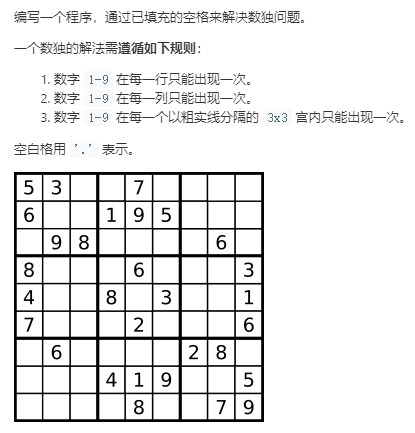
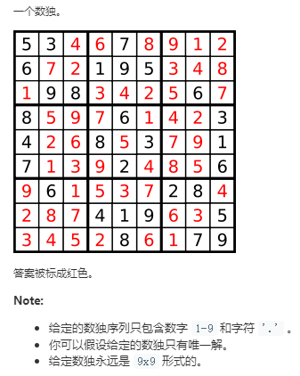

典型的回溯法编程，模块化： 约束条件，判断，插入，清除，前进，回溯

```python
from collections import defaultdict
class Solution:
    def solveSudoku(self, board: List[List[str]]) -> None:
        """
        Do not return anything, modify board in-place instead.
        """
        
        def could_place(d,row,col):
            """根据约束数字d可以放在(row,col)位置吗？"""
            return not (d in rows[row] or d in cols[col] or d in boxes[box_index(row,col)])
        
        def place_number(d,row,col):
            """将数字d放在(row,col)处,并增加约束"""
            board[row][col] = str(d)
            cols[col][d] += 1 # 第col列的第d个数是1
            rows[row][d] += 1
            boxes[box_index(row,col)][d] += 1
        
        def remove_number(d,row,col):
            """当从这条路无法进行下去的时候就要清除此"""
            board[row][col] = '.'
            del rows[row][d]  # 删除关键字为d的元素
            del cols[col][d]
            del boxes[box_index(row,col)][d]
        
        def place_next_number(row,col):
            """前进, 也就是进行递归"""
            if col == N-1 and row == N-1:
                nonlocal sudu_solved
                sudu_solved = True
            elif col == N-1:
                '''递归前进'''
                backtrack(row+1,0)
            else:
                backtrack(row,col+1)
        
        
        def backtrack(row=0,col=0):
            if board[row][col] == '.':
                for d in range(1,10):
                    if could_place(d,row,col):
                        place_number(d,row,col)
                        place_next_number(row,col)
注意点：                        前进，如果不能前进就清除，注意这里只负责当前的row,col能不能前进，而不管递归下去的路径
                        if not sudu_solved:
                            remove_number(d,row,col)
            else:
                place_next_number(row,col)
                            
        
        n = 3
        N = n*n
        box_index = lambda row,col:(row//n)*n+col//n
        """定义约束块"""
        rows = [defaultdict(int) for _ in range(N)]
        cols = [defaultdict(int) for _ in range(N)]
        boxes = [defaultdict(int) for _ in range(N)]  # 共有9个boxes, 每次向其中的boxes添加
        for i in range(N):
            for j in range(N):
                if board[i][j] != '.':
                    d = int(board[i][j])
                    place_number(d,i,j)
        sudu_solved = False
        backtrack()
```
