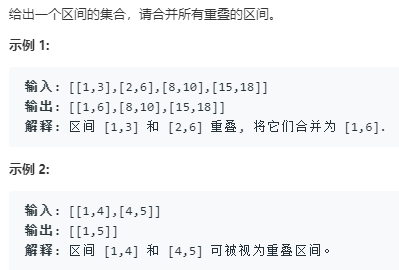

my code
```python
class Solution:
    def merge(self, intervals: List[List[int]]) -> List[List[int]]:
        if not intervals:
            return []
        intervals = sorted(intervals,key=lambda x:x[0])
        curr = intervals[0]
        res = []
        for i in range(1,len(intervals)):
            next_ = intervals[i]
            if next_[0]>curr[1]:
                res.append(curr)
                curr = next_
            else:
                if next_[1]<curr[1]:
                    curr = curr
                else:
                    curr = [curr[0],next_[1]]
        res.append(curr)
        return res
```

```python
class Solution:
    def merge(self, intervals: List[List[int]]) -> List[List[int]]:
        intervals = sorted(intervals,key=lambda x:x[0])
        res = []
        for elem in intervals:
            if not res or res[-1][-1]<elem[0]:
                res.append(elem)
            else:
                res[-1][-1] = max(elem[-1],res[-1][-1])
        return res
```
