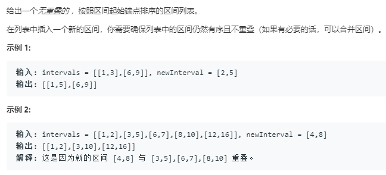

也可以参照56的解法

```python
class Solution:
    def insert(self, intervals: List[List[int]], newInterval: List[int]) -> List[List[int]]:
        res = []
        for elem in intervals:
            if newInterval and elem[-1]<newInterval[0]:
                res.append(elem)
            elif newInterval and newInterval[-1]<elem[0]:
                res.append(newInterval)
                newInterval = []
                res.append(elem)
            elif not newInterval:
                res.append(elem)
            else:
                newInterval[0] = min(newInterval[0],elem[0])
                newInterval[1] = max(newInterval[1],elem[1])
        if newInterval:
            res.append(newInterval)
        return res
```
