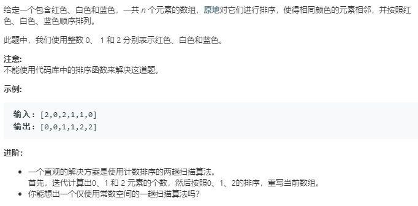

借助哈希方法
数组排序,当数组中有重复元素时,可以考虑借助哈希方法

```python
class Solution:
    def sortColors(self, nums: List[int]) -> None:
        """
        Do not return anything, modify nums in-place instead.
        """
        # 哈希方法解决
        dic = {0:0,1:0,2:0}
        for elem in nums:
            dic[elem] += 1
        for i in range(dic[0]):
            nums[i] = 0
        for i in range(dic[0],dic[0]+dic[1]):
            nums[i] = 1
        for i in range(dic[0]+dic[1],dic[0]+dic[1]+dic[2]):
            nums[i] = 2
        return nums
```

```python
class Solution:
    def sortColors(self, nums: List[int]) -> None:
        """
        Do not return anything, modify nums in-place instead.
        """
        # 使用指针来记录位置
        curr = 0
        p0 = 0
        p2 = len(nums)-1
        while curr<=p2:
            if nums[curr] == 0:
                nums[curr],nums[p0] = nums[p0],nums[curr]
                p0 += 1
                curr += 1
            elif nums[curr] == 2:
                nums[curr],nums[p2] = nums[p2],nums[curr]
                p2 -= 1
            else:
                curr += 1
```
