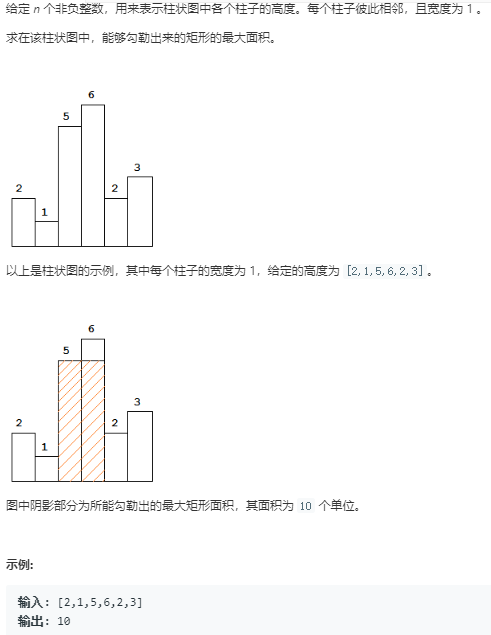

题目


第一种解法暴力解法 (超时)
```python
class Solution:
    def largestRectangleArea(self, heights: List[int]) -> int:
        # o(N^2)的解法
        max_area = 0
        for i in range(len(heights)):
            min_ = float('inf')
            for j in range(i,len(heights)):
                min_ = min(min_,heights[j])
                area = (j-i+1)*min_
                if max_area < area:
                    max_area = area
        return max_area
```

第二种解法使用辅助栈来解决
```python
class Solution:
    def largestRectangleArea(self, heights: List[int]) -> int:
        # o(N^2)的解法
        if len(heights) == 1:
            return heights[-1]
        max_area = 0
        stack = [-1]
        for i in range(len(heights)):
            if stack[-1] != -1:
                # 升序代码和降序代码可以合并成一个
                # 升序入栈
                if heights[i]>heights[stack[-1]]:
                    stack.append(i)
                # 降序出栈
                else:
                    while stack[-1] != -1 and heights[stack[-1]]>=heights[i]:
                        temp = stack.pop()  # 关键点一定要先出栈
                        max_area = max(max_area,(i-stack[-1]-1)*heights[temp])
                    stack.append(i)
            else:
                stack.append(i)
        # 栈中还有按照升序排成的数
        while stack[-1] != -1:
            temp = stack.pop()
            max_area = max(max_area,(len(heights)-stack[-1]-1)*heights[temp])
        return max_area
```
