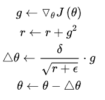
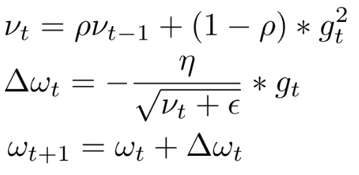

BLOG:
[深度学习优化算法入门：一、梯度下降](https://mp.weixin.qq.com/s?__biz=MzI3ODkxODU3Mg==&mid=2247487472&idx=2&sn=2c4ffdfe5430105a7a43b4762847492f&chksm=eb4eeb33dc396225b4d17acda68d58320726436a786a81c7ea132d3f9914b438df9fa25c826e&scene=21#wechat_redirect)
[深度学习优化算法入门：二、动量、RMSProp、Adam](https://mp.weixin.qq.com/s?__biz=MzI3ODkxODU3Mg==&mid=2247487565&idx=1&sn=c6d0821ee8e474439349b3a1f9fcf1a4&chksm=eb4ef48edc397d98392775e4bc441b7947f656f01e12ecdda92fa0eb88cbc65a11144e6b7680&scene=21#wechat_redirect)
[深度学习最全优化方法总结比较](https://blog.csdn.net/fishmai/article/details/52510826)
[一个框架看懂优化算法之异同 SGD/AdaGrad/Adam](https://zhuanlan.zhihu.com/p/32230623)

- 损失函数
- 网络参数
- 梯度
- 学习率

挑战
- 局部最小值
- 鞍点(仍然可以部分看作局部最小值的情形,极其不稳定稍微施加变化就足以逃出鞍点)
全样本梯度下降(逃离鞍点和局部最小值)-->随机梯度下降方法(计算缓慢,很不稳定)-->批量梯度下降方法(batch-->保证随机性的同时也要一定的稳定性以及计算速度)
上诉的方法能较好的缓解两个挑战,但是不能解决,但是的但是我们能接受较好的平坦的局部最小值可以接受的

学习率设置问题-->**通过自适应学习率来解决**
- 学习率大了在最小值附近很震荡,不易收敛到谷底;学习率小了收敛很缓慢,不易逃出局部最小值；所以这就是一对矛盾(逃出局部最小值需要大的学习率,收敛到最小值需要小的学习率),一般使用学习率衰减的方式,模拟退火
- 多种学习率设置(周期学习率,指数/余弦衰减)
- warm-up

挑战-病态曲率
- 沟壑(即梯度曲线是椭圆的),梯度在每个坐标方向相差很大的情况,一个轴上的学习率很大另一个很小,在沟壑区移动缓慢(为了不在梯度大的方向上来回震荡,需要设置小的学习率,但是这样梯度小的方向前进的速度就很慢了)

解决方式:二阶导数-->先进入平坦的底部,然后加速移动的过程,二阶导数可以告诉我们梯度是否有下降,下降的有多快
动量技术
- 实施梯度的累积,当前的下降的梯度值为改步的梯度与上一步的下降值的加权和,梯度的指数平均
- 解决的方式: 通过累积的方式不断抵消一震荡反向的梯度,而累积不震荡的方向,所以有助于缓解震荡

动量(mv): 一个物体在其运动方向上保持运动的趋势 [百科](https://baike.baidu.com/item/%E5%8A%A8%E9%87%8F/168287?fr=aladdin)

[指数加权移动平均](https://blog.csdn.net/mzpmzk/article/details/80085929)

BGD
- 稳定
- 慢
- 容易到局部

SGD
- 不稳定
- 快
- 缓解局部最小值

mini-batch
- 较稳定
- 较快
- 缓解局部最小值,an点

改进: 引入'动量'解决沟壑,引入'动量'解决学习率设置不好问题(自适应学习率)
自适应梯度(动量解决)
- 加速下降(最近更新一致时)
- 减慢下降(最近跟新不一致时) --> 缓解震荡问题

自适应学习率

SGDM(简单的使用动量)
- 直观解释: 如果以前步骤在下降那么我就要加速下降,如果前一个步骤与当前步骤不一致那么我就要适当的缓慢一下
- 当前步的梯度由以前的梯度来决定,要么梯度累加,要么梯度抵消
- 可以缓解在最小值处的震荡
- 可以缓解在沟壑区的优化问题

nesterov(涅斯捷罗夫) --> 自适应学习率
- 以前的梯度对当前的梯度值的大小有影响

AdaGrad --> 半自适应学习率
- 当前的学习率由以往的梯度的平方累积来决定(一种学习率衰减的方式)
- 一种特殊的学习率衰减, 梯度平方的平均
- 
- 缺点: 仍然需要设置学习率,且后期梯度更新缓慢

Adadelta

RMSProp --> 自适应学习率
- 梯度平方的指数滑动平均
- 较好的避免在最小值附近震荡--> 使用的是用梯度的绝对大小的累积来决定下一步学习率,当前的学习率由以前的状态决定,震荡部分(梯度值较大)累积后学习率小,非震荡部分学习率大
- 能缓解最小值处的震荡
- 能缓解沟壑

Adam 自适应梯度+自适应学习率
- 结合动量和RMSProp两者
- 参数:beta_1-->梯度的指数平均, beta_2-->梯度平方平均的指数平均
